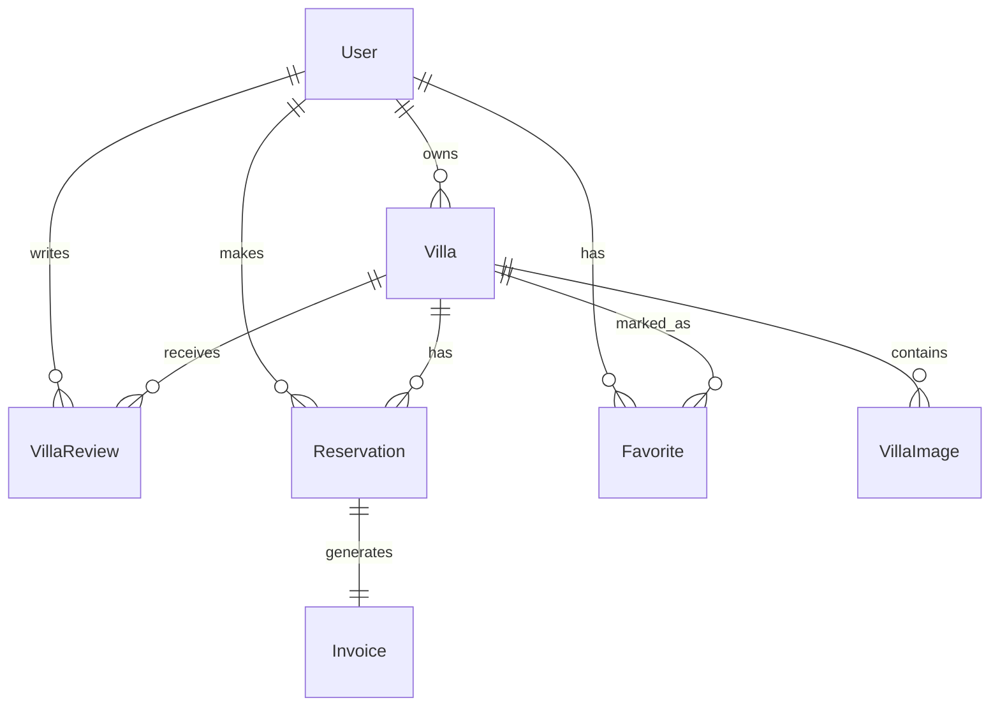

# Schéma de Base de Données - Villa Privée

## Base de données PostgreSQL

## Tables

### User
```sql
CREATE TABLE "user" (
    id SERIAL PRIMARY KEY,
    email VARCHAR(320) NOT NULL,
    password VARCHAR(255) NOT NULL,
    firstname VARCHAR(100) NOT NULL,
    lastname VARCHAR(100) NOT NULL,
    roles JSON NOT NULL,
    is_banned BOOLEAN NOT NULL,
    create_at TIMESTAMP NOT NULL,
    update_at TIMESTAMP DEFAULT NULL,
    is_verified BOOLEAN NOT NULL,
    reset_token VARCHAR(255) DEFAULT NULL,
    UNIQUE (email)
);
```

### Villa
```sql
CREATE TABLE villa (
    id SERIAL PRIMARY KEY,
    owner_id INT NOT NULL,
    title VARCHAR(255) NOT NULL,
    description TEXT NOT NULL,
    price DOUBLE PRECISION NOT NULL,
    is_active BOOLEAN NOT NULL,
    created_at TIMESTAMP NOT NULL,
    updated_at TIMESTAMP DEFAULT NULL,
    location VARCHAR(255) NOT NULL,
    bedrooms INT NOT NULL,
    bathrooms INT NOT NULL,
    capacity INT NOT NULL,
    slug VARCHAR(255) NOT NULL,
    UNIQUE (slug),
    FOREIGN KEY (owner_id) REFERENCES "user"(id)
);
```

### VillaImage
```sql
CREATE TABLE villa_image (
    id SERIAL PRIMARY KEY,
    villa_id INT NOT NULL,
    filename VARCHAR(255) NOT NULL,
    uploaded_at TIMESTAMP NOT NULL,
    FOREIGN KEY (villa_id) REFERENCES villa(id)
);
```

### VillaReview
```sql
CREATE TABLE villa_review (
    id SERIAL PRIMARY KEY,
    villa_id INT NOT NULL,
    author_id INT NOT NULL,
    content TEXT NOT NULL,
    rating DOUBLE PRECISION NOT NULL,
    created_at TIMESTAMP NOT NULL,
    FOREIGN KEY (villa_id) REFERENCES villa(id),
    FOREIGN KEY (author_id) REFERENCES "user"(id)
);
```

### Reservation
```sql
CREATE TABLE reservation (
    id SERIAL PRIMARY KEY,
    user_id INT NOT NULL,
    villa_id INT NOT NULL,
    start_date DATE NOT NULL,
    end_date DATE NOT NULL,
    total_price DOUBLE PRECISION NOT NULL,
    status VARCHAR(255) NOT NULL,
    stripe_payment_id VARCHAR(255) DEFAULT NULL,
    invoice_number VARCHAR(255) DEFAULT NULL,
    created_at TIMESTAMP NOT NULL,
    FOREIGN KEY (user_id) REFERENCES "user"(id),
    FOREIGN KEY (villa_id) REFERENCES villa(id)
);
```

### Invoice
```sql
CREATE TABLE invoice (
    id SERIAL PRIMARY KEY,
    reservation_id INT NOT NULL,
    filename VARCHAR(255) NOT NULL,
    created_at TIMESTAMP NOT NULL,
    number VARCHAR(20) NOT NULL,
    UNIQUE (reservation_id),
    FOREIGN KEY (reservation_id) REFERENCES reservation(id)
);
```

### Favorite
```sql
CREATE TABLE favorites (
    id SERIAL PRIMARY KEY,
    user_id INT NOT NULL,
    villa_id INT NOT NULL,
    created_at TIMESTAMP NOT NULL,
    FOREIGN KEY (user_id) REFERENCES "user"(id),
    FOREIGN KEY (villa_id) REFERENCES villa(id)
);
```

## Diagramme des Relations



## Notes sur le Schéma

1. **Spécificités PostgreSQL**
   - Utilisation de SERIAL pour les clés primaires auto-incrémentées
   - Type TIMESTAMP pour les dates
   - DOUBLE PRECISION pour les nombres décimaux

2. **Sécurité et Authentification**
   - Table `user` avec vérification d'email (is_verified)
   - Système de bannissement (is_banned)
   - Réinitialisation de mot de passe (reset_token)
   - Rôles en JSON

3. **Gestion des Villas**
   - Propriétaire obligatoire (owner_id)
   - Slugs uniques pour les URLs
   - Nombre de salles de bain (bathrooms)
   - Statut actif/inactif

4. **Système de Réservation**
   - Intégration Stripe (stripe_payment_id)
   - Numéro de facture dans la réservation
   - Dates de début et fin

5. **Factures**
   - Une facture par réservation (relation unique)
   - Numérotation séquentielle
   - Stockage du fichier PDF

6. **Images et Avis**
   - Images avec horodatage d'upload
   - Notes et commentaires sur les villas
   - Auteur obligatoire pour les avis

7. **Favoris**
   - Table dédiée pour les favoris
   - Relation many-to-many entre utilisateurs et villas
